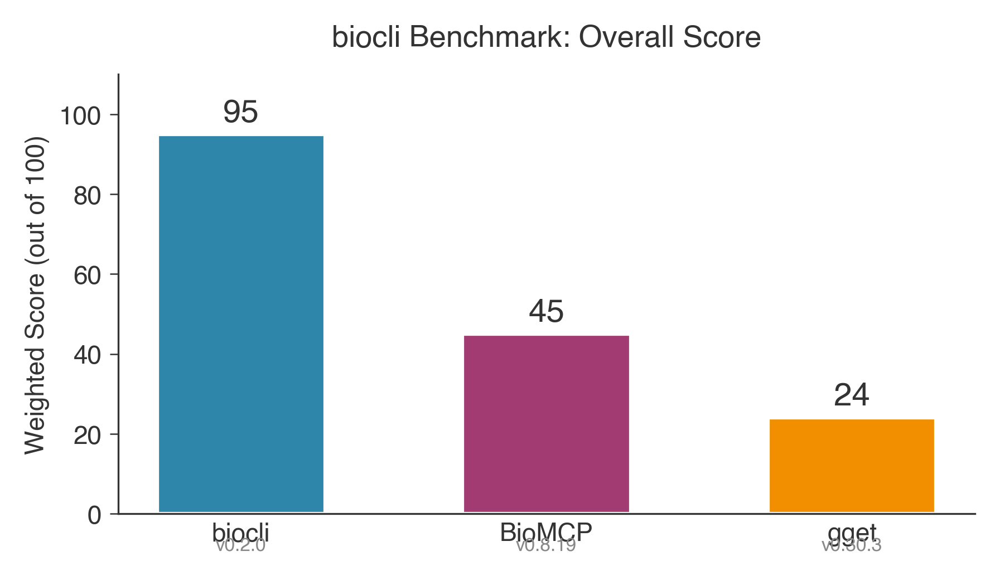
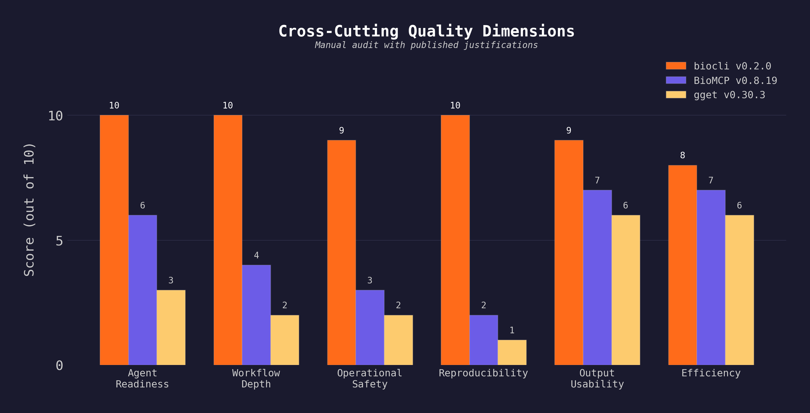
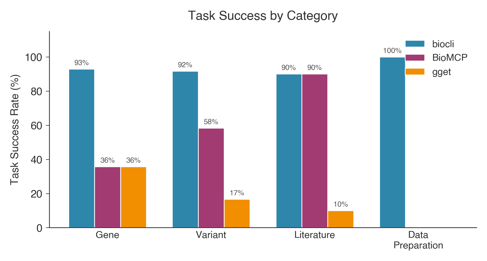

# biocli

Query biological databases from the terminal. Agent-first design.

```
biocli v0.3.9
NCBI · UniProt · KEGG · STRING · Ensembl · Enrichr
44 commands · 6 database backends · 10 workflow commands · 4 download commands
```

## Install

```bash
npm install -g @yangfei_93sky/biocli
```

Requires Node.js >= 20. No API keys needed (optional NCBI key increases rate limit).

## Why biocli

biocli is the only CLI that takes you from a **research question** to an **analysis-ready working directory** — scout datasets, download data, fetch annotations, all in one pipeline.

```bash
# Scout relevant datasets for your research question
biocli aggregate workflow-scout "TP53 breast cancer RNA-seq" --gene TP53

# Prepare a working directory with data + annotations + manifest
biocli aggregate workflow-prepare GSE315149 --gene TP53 --outdir ./project
```

Designed for **AI agents** (Claude Code, Codex CLI, etc.) — structured JSON output, per-command schema, self-describing help, batch input, local cache.

## How biocli compares

|  | biocli | gget | BioMCP | EDirect |
|--|--------|------|--------|---------|
| Query biological databases | ✅ | ✅ | ✅ | ✅ |
| Structured JSON output | ✅ | ✅ | ✅ | ❌ |
| Cross-database aggregation | ✅ | ❌ | ✅ | ❌ |
| Download GEO/SRA data files | ✅ | ❌ | ❌ | ❌ |
| Dataset discovery (scout) | ✅ | ❌ | ❌ | ❌ |
| Working directory prep (prepare) | ✅ | ❌ | ❌ | ❌ |
| Agent command self-description | ✅ | ❌ | ⚠️ | ❌ |
| Safe preview (--plan/--dry-run) | ✅ | ❌ | ❌ | ❌ |
| Per-command JSON Schema | ✅ | ❌ | ❌ | ❌ |
| Local response cache | ✅ | ❌ | ❌ | ❌ |
| Batch input (--input) | ✅ | ❌ | ✅ | ✅ |

> **gget** excels at sequence analysis (BLAST, AlphaFold, MUSCLE). **BioMCP** covers more biomedical entities (drugs, trials, diseases). **EDirect** has the deepest NCBI Entrez integration. **biocli** is the only one that combines query + download + data preparation into agent-orchestrated workflows.

### Benchmark: Agent-First Biological Workflow Tasks (2026-04-04)

12 tasks across gene intelligence, variant interpretation, literature search, and data preparation. Task scores are automated from raw output; cross-cutting scores are manual audit with published justifications. [Full methodology →](benchmarks/README.md)

<p align="center">
  
</p>

| Tool | Version | Task Success | Agent Readiness | Workflow Depth | Safety | Reproducibility | **Total** |
|------|---------|:---:|:---:|:---:|:---:|:---:|:---:|
| **biocli** | 0.2.0 | 47/49 | 10/10 | 10/10 | 9/10 | 10/10 | **96/100** |
| BioMCP | 0.8.19 | 20/49 | 6/10 | 4/10 | 3/10 | 2/10 | 44/100 |
| gget | 0.30.3 | 8/49 | 3/10 | 2/10 | 2/10 | 1/10 | 24/100 |

<details>
<summary>Detailed breakdown by dimension and category</summary>

<p align="center">
  
</p>

<p align="center">
  
</p>

</details>

> All three tools were installed (`npm install -g @yangfei_93sky/biocli`, `pip install gget==0.30.3`, `uv tool install biomcp-cli==0.8.19`) and executed on the same machine with the same inputs. Raw stdout/stderr, scoring scripts, and runner scripts are in [`benchmarks/`](benchmarks/). BioMCP excels at biomedical entity breadth (drugs, trials, diseases) not covered by this task set; gget excels at sequence analysis (BLAST, AlphaFold) not covered here.

## Quick start

**One command replaces 4 browser tabs:**

```bash
biocli aggregate gene-dossier TP53 -f json
```

Returns a unified JSON with gene summary, protein function, KEGG pathways, GO terms, protein interactions, recent literature, and clinical variants — sourced from NCBI, UniProt, KEGG, STRING, PubMed, and ClinVar in parallel.

```bash
# Gene intelligence (NCBI + UniProt + KEGG + STRING + PubMed + ClinVar)
biocli aggregate gene-dossier TP53

# Variant interpretation (dbSNP + ClinVar + Ensembl VEP)
biocli aggregate variant-dossier rs334

# Literature review with abstracts
biocli aggregate literature-brief "CRISPR cancer immunotherapy" --limit 10

# Pathway enrichment (Enrichr + STRING)
biocli aggregate enrichment TP53,BRCA1,EGFR,MYC,CDK2

# Gene profile (NCBI + UniProt + KEGG + STRING)
biocli aggregate gene-profile TP53
```

## All commands

### Workflow commands (agent-optimized)

| Command | Sources | Use case |
|---------|---------|----------|
| `aggregate gene-dossier <gene>` | NCBI+UniProt+KEGG+STRING+PubMed+ClinVar | Complete gene intelligence report |
| `aggregate variant-dossier <variant>` | dbSNP+ClinVar+Ensembl VEP | Variant interpretation |
| `aggregate variant-interpret <variant>` | dbSNP+ClinVar+VEP+UniProt | Variant interpretation with clinical context |
| `aggregate literature-brief <query>` | PubMed | Literature summary with abstracts |
| `aggregate enrichment <genes>` | Enrichr+STRING | Pathway/GO enrichment analysis |
| `aggregate gene-profile <gene>` | NCBI+UniProt+KEGG+STRING | Gene profile (no literature) |
| `aggregate workflow-scout <query>` | GEO+SRA | Scout datasets for a research question |
| `aggregate workflow-prepare <dataset>` | GEO+NCBI+UniProt+KEGG | Prepare research-ready directory with data + annotations |
| `aggregate workflow-annotate <genes>` | NCBI+UniProt+KEGG+Enrichr | Annotate gene list → genes.csv + pathways.csv + enrichment.csv + report.md |
| `aggregate workflow-profile <genes>` | NCBI+UniProt+KEGG+STRING+Enrichr | Gene set functional profile → shared pathways, interactions, GO terms |

### Database commands (atomic)

| Database | Commands |
|----------|----------|
| **PubMed** | `pubmed search`, `fetch`, `abstract`, `cited-by`, `related`, `info` |
| **Gene** | `gene search`, `info`, `fetch` (FASTA download) |
| **GEO** | `geo search`, `dataset`, `samples`, `download` |
| **SRA** | `sra search`, `run`, `download` (FASTQ via ENA/sra-tools) |
| **ClinVar** | `clinvar search`, `variant` |
| **SNP** | `snp lookup` |
| **Taxonomy** | `taxonomy lookup` |
| **UniProt** | `uniprot search`, `fetch`, `sequence` (FASTA download) |
| **KEGG** | `kegg pathway`, `link`, `disease`, `convert` |
| **STRING** | `string partners`, `network`, `enrichment` |
| **Ensembl** | `ensembl lookup`, `vep`, `xrefs` |
| **Enrichr** | `enrichr analyze` |

## Output formats

```bash
biocli gene info 7157 -f json    # JSON (default for workflow commands)
biocli gene info 7157 -f table   # Table (default for atomic commands)
biocli gene info 7157 -f yaml    # YAML
biocli gene info 7157 -f csv     # CSV
biocli gene info 7157 -f plain   # Plain text
```

## Agent-first result schema

All workflow commands (`aggregate *`) return a standard `BiocliResult` envelope:

```json
{
  "data": { ... },
  "ids": { "ncbiGeneId": "7157", "uniprotAccession": "P04637", ... },
  "sources": ["NCBI Gene", "UniProt", "KEGG", "STRING"],
  "warnings": [],
  "queriedAt": "2026-04-03T10:00:00.000Z",
  "organism": "Homo sapiens",
  "query": "TP53"
}
```

- `data` — the actual result payload
- `ids` — cross-database identifiers for the queried entity
- `sources` — which databases contributed data
- `warnings` — partial failures, ambiguous matches (never silently hidden)
- `queriedAt` — ISO timestamp for reproducibility
- `organism` — species context

## Configuration

```bash
biocli config set api_key YOUR_NCBI_KEY   # Optional: increases NCBI rate limit 3→10 req/s
biocli config set email you@example.com
biocli config show
```

Config stored at `~/.biocli/config.yaml`.

## Rate limits

| Database | Rate | Auth |
|----------|------|------|
| NCBI | 3/s (10/s with API key) | Optional API key |
| UniProt | 50/s | None |
| KEGG | 10/s | None |
| STRING | 1/s | None |
| Ensembl | 15/s | None |
| Enrichr | 5/s | None |

All rate limits are enforced automatically per-database.

## License

MIT
