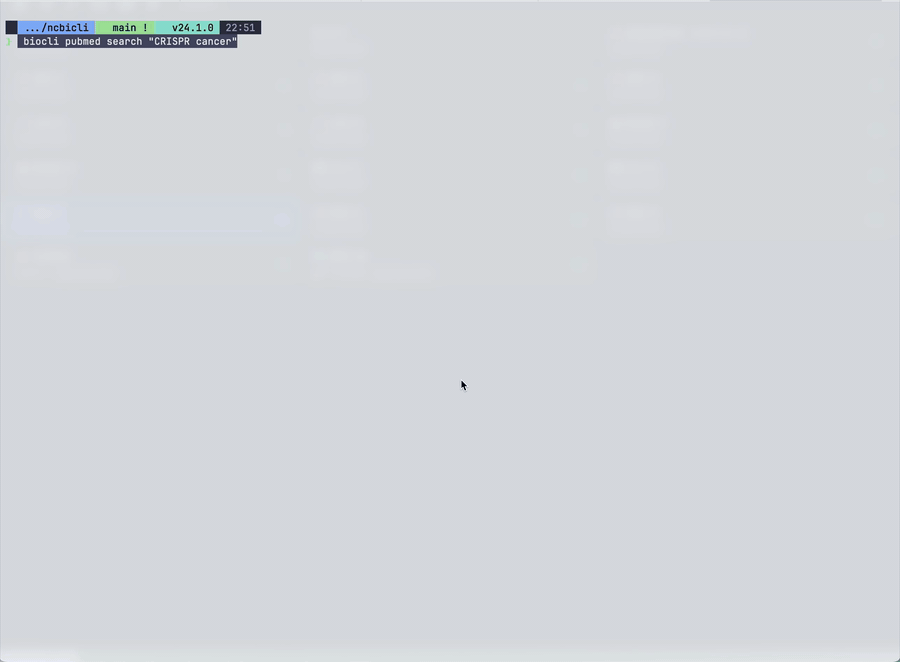
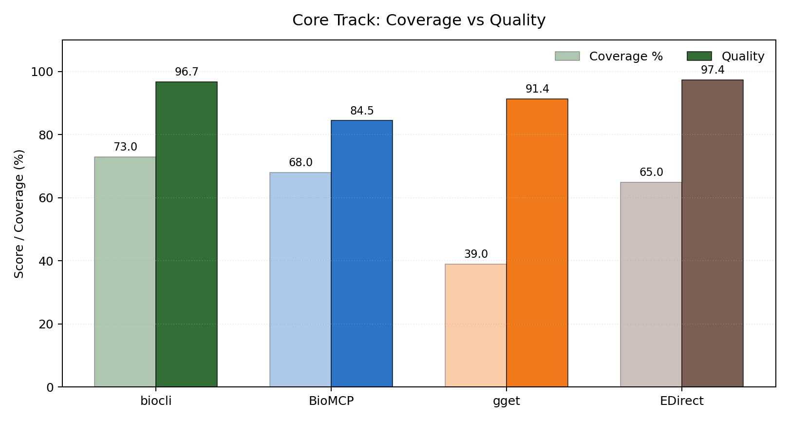
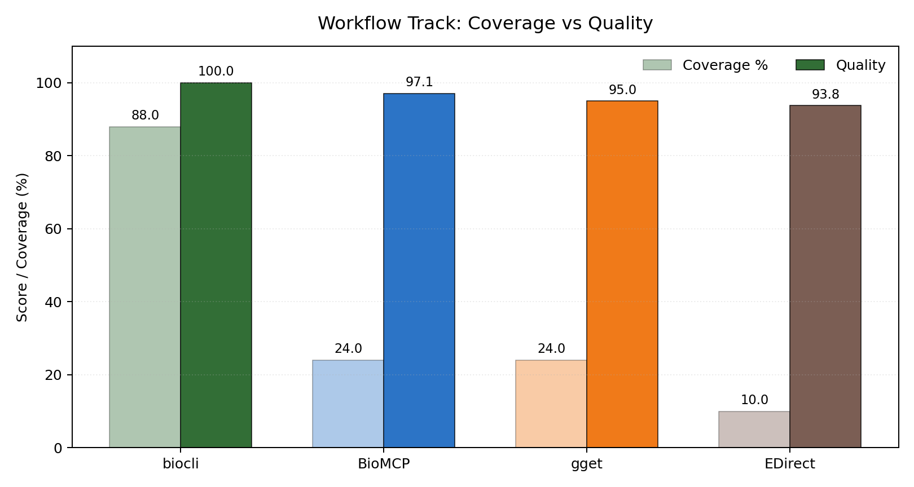
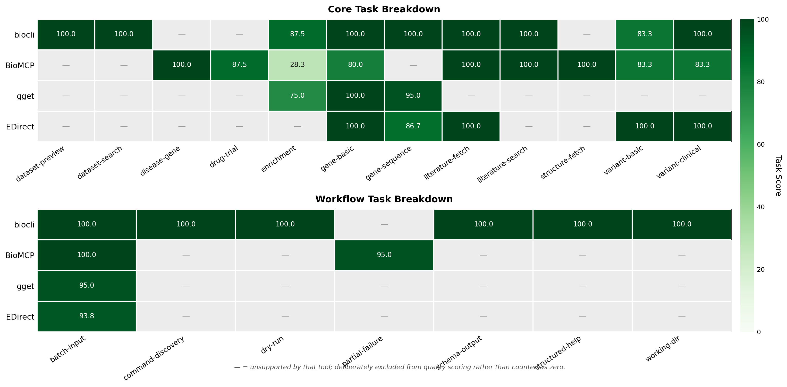

# biocli

[](https://doi.org/10.5281/zenodo.19483760)
[](https://github.com/youngfly93/biocli/actions/workflows/ci.yml)
[](https://www.npmjs.com/package/@yangfei_93sky/biocli)
[](https://nodejs.org)
[](LICENSE)
[](https://github.com/youngfly93/biocli/releases)
[](#all-commands)
[](benchmarks/v2/runs/report-public-stable/public_report.md)

**One terminal command replaces four browser tabs.**
biocli is the agent-first CLI for biological databases — 65 commands across 11 backends (NCBI, UniProt, KEGG, STRING, Ensembl, Enrichr, ProteomeXchange, PRIDE, cBioPortal, Open Targets, GDSC) plus local reference datasets, all behind a strict JSON contract.

<p align="center">
  
</p>

```
biocli v0.4.1
NCBI · UniProt · KEGG · STRING · Ensembl · Enrichr · ProteomeXchange · PRIDE · cBioPortal · Open Targets · GDSC · Unimod (local)
65 commands · 11 database backends · 2 reference datasets · 14 workflow commands · 4 download commands
```

## Install

biocli is published on npm today, and this repository now includes a conda packaging scaffold under [`packaging/conda`](packaging/conda/README.md). The long-term preferred command for research environments will be:

```bash
conda install -c bioconda -c conda-forge biocli
```

Until that public conda channel exists, use one of the install paths below.

### 1. Choose an install path

| Path | Command | When to use |
|---|---|---|
| Conda-managed env + npm | `conda create -n biocli -c conda-forge "nodejs>=20" && conda activate biocli && npm install -g @yangfei_93sky/biocli` | Best current path if you already work inside conda |
| npm global | `npm install -g @yangfei_93sky/biocli` | Fastest path today |
| Local conda package | `npm run verify:conda && npm run build:conda:local && conda install -c local biocli` | Internal mirrors, packagers, or early conda validation |

### 2. Prerequisites

biocli needs **Node.js >= 20**. If you don't already have Node.js installed:

| Platform | Command |
|---|---|
| macOS (Homebrew) | `brew install node` |
| Already using conda? | `conda install -c conda-forge 'nodejs>=20'` |
| Cross-platform (nvm, recommended for devs) | `nvm install 20 && nvm use 20` |
| Windows | Download the LTS installer from [nodejs.org](https://nodejs.org) |
| Other Linux distros | See the [nodejs.org package manager guide](https://nodejs.org/en/download/package-manager) — distro repos often ship an outdated Node.js, so NodeSource or nvm is usually the safe path |

Confirm you have Node >= 20: `node -v` should print `v20.x` or higher.

No API keys are needed. An optional NCBI API key raises your NCBI rate limit from 3 to 10 req/s (see [Configuration](#configuration)), but biocli works out of the box without one.

### 3. Install biocli

```bash
npm install -g @yangfei_93sky/biocli
```

If you want the conda route instead, see [`packaging/conda/README.md`](packaging/conda/README.md). That guide now includes a repo-local build helper and notes about the several GB of disk conda packaging can consume.

### 4. Verify the install

Three commands that confirm biocli is wired up end-to-end. Expected runtime: under 15 seconds.

```bash
biocli --version                              # should print 0.4.1
biocli verify --smoke -f json                 # config + doctor + 6 core smoke tests
biocli aggregate gene-dossier TP53 -f json    # real query across NCBI / UniProt / KEGG / STRING / PubMed / ClinVar
biocli aggregate tumor-gene-dossier TP53 --study acc_tcga_pan_can_atlas_2018 -f json
biocli aggregate drug-target EGFR --disease lung -f json
```

If all three return without error, biocli is installed and every upstream API is reachable from your network.

## Quick start

```bash
biocli aggregate gene-dossier TP53 -f json
```

Returns a unified JSON with gene summary, protein function, KEGG pathways, GO terms, protein interactions, recent literature, and clinical variants — sourced from NCBI, UniProt, KEGG, STRING, PubMed, and ClinVar in parallel.

```bash
# Gene intelligence (NCBI + UniProt + KEGG + STRING + PubMed + ClinVar)
biocli aggregate gene-dossier TP53

# Variant interpretation (dbSNP + ClinVar + Ensembl VEP)
biocli aggregate variant-dossier rs334

# Literature review with abstracts
biocli aggregate literature-brief "CRISPR cancer immunotherapy" --limit 10

# Pathway enrichment (Enrichr + STRING)
biocli aggregate enrichment TP53,BRCA1,EGFR,MYC,CDK2

# Gene profile (NCBI + UniProt + KEGG + STRING)
biocli aggregate gene-profile TP53

# Structured cross-gene comparison
biocli aggregate compare-genes TP53,BRCA1,EGFR -f json

# Tumor genomics prevalence in cBioPortal
biocli cbioportal frequency TP53 --study acc_tcga_pan_can_atlas_2018 -f json

# Tumor-aware hero workflow
biocli aggregate tumor-gene-dossier TP53 --study acc_tcga_pan_can_atlas_2018 --co-mutations 5 -f json

# Target tractability + drug candidates with GDSC sensitivity evidence
biocli aggregate drug-target EGFR --disease lung -f json

# Add a tumor-study overlay from cBioPortal with study-aware ranking
biocli aggregate drug-target EGFR --disease lung --study luad_tcga_pan_can_atlas_2018 -f json

# Tumor co-mutation partners in cBioPortal
biocli cbioportal co-mutations EGFR --study luad_tcga_pan_can_atlas_2018 --limit 10 -f json

# Prewarm local GDSC sensitivity evidence before first drug-target query
biocli gdsc prewarm

# Cross-omics: find proteomics datasets reporting a PTM on a specific gene
biocli aggregate ptm-datasets TP53 --modification phospho --limit 5
```

## Why biocli

biocli's workflow commands go beyond retrieval. They scout datasets, download data, fetch annotations, and produce a manifest-tracked working directory in a single pipeline — the kind of multi-step job that otherwise takes four browser tabs and a shell script.

```bash
# Scout relevant datasets for your research question
biocli aggregate workflow-scout "TP53 breast cancer RNA-seq" --gene TP53

# Prepare a working directory with data + annotations + manifest
biocli aggregate workflow-prepare GSE315149 --gene TP53 --outdir ./project
```

Benchmark v2 shows biocli at **88% workflow coverage with 100.0 quality** on supported tasks; next-best (BioMCP) is 24% at 97.1. See the [benchmark section](#benchmark-v2) for the full four-tool comparison.

Designed for **AI agents** (Claude Code, Codex CLI, etc.) — structured JSON output, per-command schema, self-describing help, batch input, local cache, and an optional MCP companion package.

## Who is this for

**biocli is for you if:**

- You run multi-database biological queries and the browser-tab shuffle between NCBI, UniProt, KEGG, STRING, Ensembl, and cBioPortal is eating your mornings.
- You're a grad student, postdoc, or research engineer who wants programmatic access to public biology data without writing a dozen bespoke HTTP clients.
- You use Claude Code, Codex CLI, Cursor, or any AI coding agent that needs **reliable, structured, self-describing** biological data — not screen-scraped HTML or ad-hoc JSON shapes.
- You're a proteomics researcher looking for the first CLI with a native Unimod PTM dictionary plus ProteomeXchange / PRIDE federation.

**biocli is *not*:**

- A sequence-analysis framework. No BLAST, no multiple-sequence alignment, no AlphaFold. Use [gget](https://github.com/pachterlab/gget) for sequence-centric workflows.
- A full drug / clinical-trial / disease-entity explorer. biocli now has a target-centric `aggregate drug-target` workflow, but use [BioMCP](https://github.com/genomoncology/biomcp) when you need broader biomedical entity coverage.
- A Bioconductor or Biopython replacement. biocli retrieves data; it does not run statistical models, build plots, or manipulate sequences. Feed its JSON output into your existing analysis framework.
- A local database or offline store. biocli wraps live REST APIs with a 24-hour local response cache; it does not bulk-download and index anything server-side. The one exception is the `unimod` command family, which queries a local snapshot.

## Agent-first result schema

All workflow commands (`aggregate *`) return a standard `BiocliResult` envelope:

```json
{
  "data": { ... },
  "ids": { "ncbiGeneId": "7157", "uniprotAccession": "P04637", ... },
  "sources": ["NCBI Gene", "UniProt", "KEGG", "STRING"],
  "warnings": [],
  "queriedAt": "2026-04-03T10:00:00.000Z",
  "organism": "Homo sapiens",
  "query": "TP53"
}
```

- `data` — the actual result payload
- `ids` — cross-database identifiers for the queried entity
- `sources` — which databases contributed data
- `warnings` — partial failures, ambiguous matches (never silently hidden)
- `queriedAt` — ISO timestamp for reproducibility
- `organism` — species context

Agents that parse biocli output never need to branch on command type — every `aggregate *` command returns the same envelope shape, and `warnings` is the canonical channel for partial-failure signaling.

## Use it with your agent

biocli is shell-first by default. Agents can run commands directly and parse JSON. If you need MCP transport, use the optional companion package under [`packages/biocli-mcp`](packages/biocli-mcp/README.md).

### Shell-first

### Discover capabilities at runtime

```bash
biocli list -f json          # full catalog of all 65 commands with args, types, defaults, columns
biocli schema                # JSON Schema for the BiocliResult envelope
biocli schema meta           # JSON Schema for the result metadata wrapper
biocli verify --smoke -f json   # preflight: config + doctor + smoke tests in one call
```

`biocli list -f json` returns one object per command with fields like:

```json
{
  "command": "aggregate/gene-dossier",
  "description": "Complete gene intelligence report (profile + literature + clinical)",
  "database": "aggregate",
  "args": [
    { "name": "gene", "type": "str", "required": true, "positional": true, "help": "Gene symbol (e.g. TP53)" },
    { "name": "organism", "type": "str", "default": "human", "help": "Organism (e.g. human, mouse)" },
    { "name": "papers", "type": "int", "default": 5, "help": "Number of recent papers to include" }
  ],
  "tags": ["workflow"]
}
```

An agent can extract the schema for any command without touching documentation:

```bash
biocli list -f json | jq '.[] | select(.name=="gene-dossier")'
```

### From Python (via `subprocess`)

```python
import json, subprocess

result = json.loads(subprocess.check_output([
    "biocli", "aggregate", "gene-dossier", "TP53", "-f", "json"
]))

print(result["data"]["symbol"])          # "TP53"
print(result["sources"])                 # ["NCBI Gene", "UniProt", "KEGG", ...]
for w in result["warnings"]:
    print(f"  degraded: {w}")            # partial failures surface here, never silently hidden
```

### Bash + `jq` pipeline

```bash
# Dossier for a gene list, one per line
cat genes.txt | while read g; do
  biocli aggregate gene-dossier "$g" -f json \
    | jq -r '[.query, .data.symbol, (.data.pathways // [] | length)] | @tsv'
done
```

Every biocli command keeps **warnings on stderr** and **payload on stdout**, so pipes into `jq` / `python -m json.tool` never choke on noise.

### MCP-first

```bash
npm run build
node packages/biocli-mcp/cli.js install --dry-run
node packages/biocli-mcp/cli.js serve --scope hero
```

That companion package exposes hero workflows such as `gene-dossier`, `tumor-gene-dossier`, `drug-target`, `variant-dossier`, `literature-brief`, and `workflow-prepare` as MCP tools for Claude Desktop or any compatible MCP client, while keeping the core `biocli` install lean.

## How biocli compares

|  | biocli | gget | BioMCP | EDirect |
|--|--------|------|--------|---------|
| Structured JSON output | ✅ | ✅ | ✅ | ❌ |
| Cross-database aggregation | ✅ | ❌ | ✅ | ❌ |
| Download GEO/SRA data files | ✅ | ❌ | ❌ | ❌ |
| Dataset discovery (scout) | ✅ | ❌ | ❌ | ❌ |
| Working directory prep (prepare) | ✅ | ❌ | ❌ | ❌ |
| Agent command self-description | ✅ | ❌ | ⚠️ | ❌ |
| Safe preview (--dry-run/--skip-download) | ✅ | ❌ | ❌ | ❌ |
| Per-command JSON Schema | ✅ | ❌ | ❌ | ❌ |
| Local response cache | ✅ | ❌ | ❌ | ❌ |
| Batch input (--input) | ✅ | ❌ | ✅ | ✅ |
| Reference Dataset snapshot (Unimod) | ✅ | ❌ | ❌ | ❌ |
| Proteomics federation (ProteomeXchange + PRIDE) | ✅ | ❌ | ❌ | ❌ |
| Sequence similarity (BLAST / DIAMOND) | ❌ | ✅ | ❌ | ❌ |
| Protein structure fetch (AlphaFold / PDB) | ❌ | ✅ | ✅ | ❌ |
| Disease / drug / clinical-trial lookup | ❌ | ❌ | ✅ | ❌ |

> **gget** excels at sequence analysis (BLAST, AlphaFold, MUSCLE). **BioMCP** covers more biomedical entities (drugs, trials, diseases). **EDirect** has the deepest NCBI Entrez integration. **biocli** combines query + download + data preparation into a single agent-orchestrated pipeline; among the four tools in this comparison, it's the only one shipping a Reference Dataset pattern (local Unimod snapshot) and federated proteomics coverage (ProteomeXchange + PRIDE).

## Benchmark v2

Four tools (biocli, BioMCP, gget, EDirect), **n=3 cold runs per cell**, coverage and quality reported separately — unsupported tasks move to the coverage column rather than being scored as zeros. [Full methodology →](benchmarks/v2/rubric.md) · [Public report →](benchmarks/v2/runs/report-public-stable/public_report.md) · [Capability matrix →](benchmarks/v2/capability_matrix.frozen.csv)

### Core retrieval

<p align="center">
  
</p>

| Tool | Version¹ | Coverage % | Quality (supported) | p50 latency |
|------|---------|:---:|:---:|:---:|
| **biocli** | 0.3.9 | **73** | 96.7 | **128 ms** |
| EDirect | 25.3 | 65 | **97.4** | 5 291 ms |
| BioMCP | 0.8.19 | 68 | 84.5 | 2 516 ms |
| gget | 0.30.3 | 39 | 91.4 | 9 563 ms |

### Workflow

<p align="center">
  
</p>

| Tool | Version¹ | Coverage % | Quality (supported) | p50 latency |
|------|---------|:---:|:---:|:---:|
| **biocli** | 0.3.9 | **88** | **100.0** | **134 ms** |
| BioMCP | 0.8.19 | 24 | 97.1 | 3 837 ms |
| gget | 0.30.3 | 24 | 95.0 | 32 523 ms |
| EDirect | 25.3 | 10 | 93.8 | 2 323 ms |

> **EDirect leads core quality on the supported overlap; biocli leads coverage and dominates the workflow track.** No combined "winner" total by design — core and workflow measure different things.

<details>
<summary>Per-task breakdown (heatmap)</summary>

<p align="center">
  
</p>

`N/A` = unsupported by that tool; deliberately excluded from quality scoring rather than counted as zero.

</details>

<sup>¹ Benchmark executed against biocli 0.3.9. Version 0.4.0 is binary-identical for the 17 scored cells — the 0.4.0 additions (Unimod + ProteomeXchange) extend biocli's scope beyond the current v2 task set and will be added in a later benchmark cycle.</sup>

## Command reference

biocli ships **65 commands** across 13 agent-optimized workflows. For the live, machine-readable catalog (including args, types, defaults, and columns):

```bash
biocli list                 # human-readable table
biocli list -f json         # full JSON with per-command schema
```

<details>
<summary><b>Click to expand: full command table</b></summary>

### Workflow commands (agent-optimized)

| Command | Sources | Use case |
|---------|---------|----------|
| `aggregate gene-dossier <gene>` | NCBI+UniProt+KEGG+STRING+PubMed+ClinVar | Complete gene intelligence report |
| `aggregate compare-genes <genes>` | NCBI+UniProt+KEGG+STRING+Enrichr | Compare a gene set across shared pathways, GO terms, STRING subnetwork, and set-level GO enrichment |
| `aggregate tumor-gene-dossier <gene> --study <study>` | gene-dossier + cBioPortal | Tumor-focused gene dossier with prevalence, exemplar variants, and co-mutations |
| `aggregate drug-target <gene> [--disease <term>] [--study <study>]` | Open Targets + GDSC + optional cBioPortal overlay | Target tractability, candidate drugs, disease context, clinical evidence links, GDSC sensitivity support, optional tumor prevalence / co-mutations, and study-aware ranking signals |
| `aggregate variant-dossier <variant>` | dbSNP+ClinVar+Ensembl VEP | Variant interpretation |
| `aggregate variant-interpret <variant>` | dbSNP+ClinVar+VEP+UniProt | Variant interpretation with clinical context |
| `aggregate literature-brief <query>` | PubMed | Literature summary with abstracts |
| `aggregate enrichment <genes>` | Enrichr+STRING | Pathway/GO enrichment analysis |
| `aggregate gene-profile <gene>` | NCBI+UniProt+KEGG+STRING | Gene profile (no literature) |
| `aggregate workflow-scout <query>` | GEO+SRA | Scout datasets for a research question |
| `aggregate workflow-prepare <dataset>` | GEO+NCBI+UniProt+KEGG | Prepare research-ready directory with data + annotations |
| `aggregate workflow-annotate <genes>` | NCBI+UniProt+KEGG+Enrichr | Annotate gene list → genes.csv + pathways.csv + enrichment.csv + report.md |
| `aggregate workflow-profile <genes>` | NCBI+UniProt+KEGG+STRING+Enrichr | Gene set functional profile → shared pathways, interactions, GO terms |
| `aggregate ptm-datasets <gene> --modification <type>` | Unimod + ProteomeXchange | Find proteomics datasets reporting a specific PTM on a gene |

### Database commands (atomic)

| Database | Commands |
|----------|----------|
| **PubMed** | `pubmed search`, `fetch`, `abstract`, `cited-by`, `related`, `info` |
| **Gene** | `gene search`, `info`, `fetch` (FASTA download) |
| **GEO** | `geo search`, `dataset`, `samples`, `download` |
| **SRA** | `sra search`, `run`, `download` (FASTQ via ENA/sra-tools) |
| **ClinVar** | `clinvar search`, `variant` |
| **SNP** | `snp lookup` |
| **Taxonomy** | `taxonomy lookup` |
| **UniProt** | `uniprot search`, `fetch`, `sequence` (FASTA download) |
| **KEGG** | `kegg pathway`, `link`, `disease`, `convert` |
| **STRING** | `string partners`, `network`, `enrichment` |
| **Ensembl** | `ensembl lookup`, `vep`, `xrefs` |
| **Enrichr** | `enrichr analyze` |
| **GDSC** | `gdsc prewarm`, `gdsc refresh` |
| **Open Targets** | workflow-only in v1 via `aggregate drug-target` |
| **ProteomeXchange** | `px search`, `dataset`, `files` |
| **Unimod** *(local snapshot)* | `unimod fetch`, `install`, `refresh`, `search`, `list`, `by-mass`, `by-residue` |

</details>

## Proteomics modules

### Unimod — local PTM dictionary

Unimod is the mass-spec community's canonical post-translational modification dictionary (~1560 entries). Unlike the live REST backends, it's distributed as an XML dump that biocli downloads once into `~/.biocli/datasets/unimod.xml` and queries in memory. First-run install:

```bash
biocli unimod install                              # one-time download
biocli unimod by-mass 79.9663 --tolerance 0.001    # open-search PTM annotation
biocli unimod by-mass -18.0106 --tolerance 0.001   # negative deltas (water loss, etc.)
biocli unimod by-residue K --classification "Post-translational" --include-hidden
biocli unimod fetch UNIMOD:21                      # full record for one modification
```

`unimod by-mass` is designed for open-search proteomics workflows: feed it a mass shift from MSFragger / pFind / FragPipe and it returns ranked candidate modifications with delta-from-query. Supports both Da and ppm tolerance, positive and negative deltas (e.g. -18.0106 for water loss). Batch mode via `--input deltas.txt` annotates a whole column of delta masses at once.

### ProteomeXchange + PRIDE — proteomics data repositories

biocli wraps the PROXI v0.1 hub at ProteomeCentral, which federates PRIDE, iProX, MassIVE, and jPOST under one search API. PRIDE is added as a secondary backend for rich per-project metadata (35+ fields) when a dataset is PRIDE-hosted.

```bash
biocli px search "TP53" --limit 5                       # federated dataset search
biocli px dataset PXD000001                              # full metadata + auto PRIDE upgrade
biocli px files PXD000001                                # PRIDE file list with FTP URLs
biocli aggregate ptm-datasets TP53 --modification phospho   # gene + PTM → ranked PXD list
```

`px dataset` queries the hub first then automatically upgrades PRIDE-hosted projects with the rich PRIDE Archive metadata (`identifiedPTMStrings`, sample protocols, etc.). Graceful fallback to hub-only data with a warning if PRIDE is unavailable. `px files` is PRIDE-only in v1 and exits with `NOT_SUPPORTED` for non-PRIDE accessions, with a hint linking to the source repo's web browser.

The `aggregate ptm-datasets` workflow fuses Unimod + ProteomeXchange to answer a single specific question across both sources: *"give me the public datasets where this PTM has been reported on this gene."* No other tool in the comparison table combines a PTM dictionary with federated proteomics search.

## Output formats

```bash
biocli gene info 7157 -f json    # JSON (default for workflow commands)
biocli gene info 7157 -f table   # Table (default for atomic commands)
biocli gene info 7157 -f yaml    # YAML
biocli gene info 7157 -f csv     # CSV
biocli gene info 7157 -f plain   # Plain text
```

## Configuration

```bash
biocli config set api_key YOUR_NCBI_KEY   # Optional: increases NCBI rate limit 3→10 req/s
biocli config set email you@example.com
biocli config show
```

Config stored at `~/.biocli/config.yaml`.

## Rate limits

| Database | Rate | Auth |
|----------|------|------|
| NCBI | 3/s (10/s with API key) | Optional API key |
| UniProt | 50/s | None |
| KEGG | 10/s | None |
| STRING | 1/s | None |
| Ensembl | 15/s | None |
| Enrichr | 5/s | None |

All rate limits are enforced automatically per-database.

## FAQ

**How is this different from `rentrez`, Biopython, or Bioconductor packages?**
Those are analysis frameworks that happen to include API clients. biocli is a *retrieval* tool — it does one thing (query public biological databases from the terminal with a strict JSON contract) and does not try to model, visualize, or analyze the data. Think of biocli as the "fetch" stage that feeds your Bioconductor / Biopython / scanpy workflow. The two are complementary, not competitive.

**Do I need API keys?**
No. All supported backends work without authentication. You can optionally set an NCBI API key to raise your NCBI rate limit from 3 req/s to 10 req/s (`biocli config set api_key YOUR_KEY`), but it is never required and every other backend (UniProt, KEGG, STRING, Ensembl, Enrichr, ProteomeXchange, PRIDE, Unimod) is keyless by design.

**Can I use biocli offline?**
Mostly no. biocli wraps live REST APIs and caches responses for 24 hours by default, so cached queries work offline but fresh lookups need network access. The one full-offline exception is the `unimod` command family — Unimod is downloaded once via `biocli unimod install` and then queried entirely in memory against `~/.biocli/datasets/unimod.xml`, no network needed.

**Does biocli work on Windows?**
Yes, on Windows 10/11 with Node.js >= 20. Native shells (PowerShell, cmd) and WSL2 both work. Earlier 0.3.x releases shipped undici dispatcher fixes for WSL2 IPv6 hangs, so WSL2 users should be on 0.3.9 or later. The one known Windows-only limitation: the legacy `ncbicli` stderr deprecation warning does not fire on Windows because the npm `.cmd` shim re-spawns Node with the resolved `.js` path, so `process.argv[1]` no longer contains the string `ncbicli`.

**How do I add a new database backend?**
Copy `src/databases/uniprot.ts` or `src/databases/enrichr.ts` as a template, implement the `DatabaseBackend` interface (`id`, `name`, `baseUrl`, `rateLimit`, `createContext()`), register it via a side-effect import in `src/main.ts`, then add commands under `src/clis/<your-db>/` as either YAML adapters (simple single-fetch) or TypeScript adapters (multi-step). For data sources distributed as static XML / TSV snapshots rather than REST APIs (like Unimod), use the newer **Reference Dataset** pattern in `src/datasets/` with `noContext: true` on the command registration — this skips the HTTP context factory and the response cache entirely. See [`ARCHITECTURE.md`](ARCHITECTURE.md) and [`PLUGIN_DEV.md`](PLUGIN_DEV.md).
